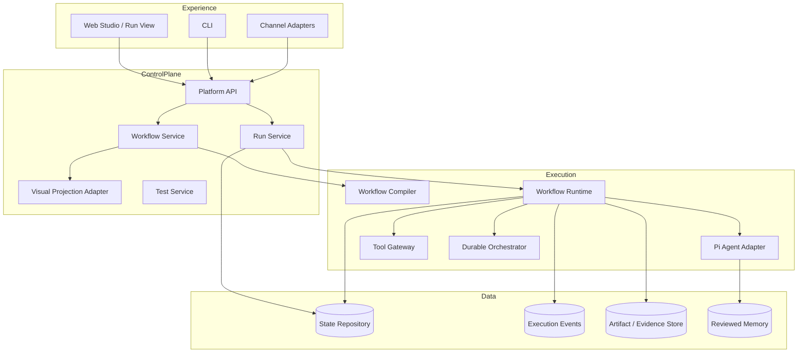

# Design Doc：Oncall Workflow Platform 系统架构与演进模型

- **版本**：v0.6
- **状态**：Active Architecture Baseline
- **日期**：2026-07-17
- **当前实现目标**：M0 Functional Gate
- **目标架构范围**：M0–M5

## 1. 设计目标

构建一个以 Workflow 为控制平面、以 Pi Agent 为推理运行时的可信 Oncall 自动化平台，并保证架构可以逐步演进到：

- 可视化；
- 可版本化；
- 可持久化；
- 可观察；
- 可恢复；
- 可测试；
- 可审计；
- 可安全接入 Tool、Human、Channel 和 Memory。

本版新增一条重要约束：

> 完整架构定义演进方向，但当前实现只建设支撑下一个纵向产品切片的最小结构。

## 2. 设计方法

### 2.1 Logical Architecture vs Physical Implementation

逻辑架构描述最终职责边界；物理实现允许阶段性合并。

例如：

- 逻辑上存在 API、Run Service、Workflow Runtime、Agent Adapter；
- M0 可以部署在一个进程或容器中；
- M2 再拆出独立 Worker 和 Durable Orchestrator。

这避免两种错误：

1. 因为当前单进程就把未来职责混在一起；
2. 为了未来分布式架构，第一天就建立复杂队列、lease、事件和恢复系统。

### 2.2 Vertical Slice

每个切片贯穿：

```text
Web
→ API
→ Domain
→ Runtime Adapter
→ Provider
→ Result
```

优先形成真实行为，再补必要测试和结构整理。

### 2.3 Evolutionary Boundaries

提前稳定的是接口和业务语义，不是全部基础设施：

- Run 有独立 ID 和状态；
- Definition 是服务端事实；
- Agent 通过 Adapter；
- UI 不直接执行 Runtime；
- Provider Secret 只在服务端；
- 状态存储通过 Repository；
- 实时更新通过 Event/Status Port。

具体使用内存、PostgreSQL、polling、SSE 或 Durable Engine，可以按阶段替换。

## 3. 总体架构



## 4. 外部能力边界

### 4.1 Pi Agent

Pi Agent 提供 Agent Loop、消息、Tool 调用、上下文处理和 Runtime Event。平台负责：

- Agent Definition / Version；
- Context Policy；
- Provider Binding；
- Tool/Skill Allowlist；
- Budget；
- Completion Contract；
- Runtime Event normalization；
- Workflow Node 级状态与历史。

禁止把 Pi Session ID 当作 WorkflowRun ID，也不把 Pi 内部类型暴露为公共 API。

### 4.2 FlowGram

FlowGram 用于 Canvas、Node Form、Variable 和工作流开发 UI。平台：

- 使用 Visual Projection Adapter；
- 不使用 Canvas JSON 作为生产事实；
- 不让 FlowGram Runtime 替代自有 Workflow Runtime；
- 不把 FlowGram Entity ID 作为平台主键。

### 4.3 Channel

Feishu 等 Channel 负责 Trigger、Ack、Reply、Card、Dedup 和 Identity Mapping，不定义内部 Workflow 结构。

## 5. 模型分层

### 5.1 Product Model

- Workflow
- WorkflowDefinitionVersion
- AgentDefinitionVersion
- WorkflowRun
- NodeRun
- NodeRunAttempt
- ExecutionEvent
- Interaction
- Artifact
- Evidence
- TestCase
- MemoryEpisode

### 5.2 Authoring Model

- node position；
- viewport；
- annotation；
- inspector draft；
- group/fold；
- selection；
- visual port metadata。

Authoring Model 只能引用 Product ID，不能创造第二套业务语义。

### 5.3 WorkflowIR

Compiler 输出不可变执行计划：

- normalized nodes；
- control transitions；
- data mappings；
- error transitions；
- loop regions；
- child workflow references；
- effective version snapshot；
- diagnostics。

### 5.4 Runtime Model

- current Run state；
- current Node state；
- Attempt history；
- Event history；
- Interaction waiting；
- Tool/Provider outcome；
- Artifact/Evidence；
- effective configuration。

## 6. Workflow Definition

### 6.1 事实来源

JSON Workflow Definition 是唯一业务事实来源。最终形态：

```ts
interface WorkflowDefinitionVersion {
  id: string
  workflowId: string
  version: string
  schemaVersion: string
  definition: JsonValue
  definitionHash: string
  status: "draft" | "published" | "archived"
  createdAt: string
}
```

M0 可以只使用一个 seed 文件，并暂不实现发布 UI；M1/M4 再引入持久化版本和 Draft/Publish。

### 6.2 Node Family

- Input
- Process
- Logic
- Output

Annotation 不是可执行 Family。

示例 Node Type：

- `input.prompt`
- `process.agent`
- `process.tool`
- `logic.switch`
- `logic.guard`
- `output.markdown`

### 6.3 语义分离

- Control Transition：何时执行；
- Data Mapping：字段如何传递；
- Error Transition：失败进入哪条路径；
- Runtime Context：平台注入的 Run、Actor、Trace、Memory Scope 等信息。

UI 可以把 Mapping 显示为端口连接，但 Compiler 必须产生明确语义。

### 6.4 M0 Definition

M0 只需要：

```json
{
  "apiVersion": "workflow.platform/v1alpha1",
  "kind": "Workflow",
  "metadata": {
    "id": "hello-agent",
    "name": "Hello Agent"
  },
  "spec": {
    "nodes": [
      {"id": "input", "type": "input.prompt"},
      {
        "id": "agent",
        "type": "process.agent",
        "config": {"agentRef": "default"}
      },
      {"id": "output", "type": "output.markdown"}
    ],
    "edges": [
      {"source": "input", "target": "agent"},
      {"source": "agent", "target": "output"}
    ]
  }
}
```

M0 可以由简单校验器处理；正式 JSON Schema、canonical hash 和 migration 在 M1 引入。

## 7. Run API 契约

即使 M0 内部可以同步或单进程执行，对外仍使用 Run 语义：

```text
POST /api/workflows/{id}/runs
GET  /api/runs/{runId}
```

最小返回：

```ts
interface WorkflowRunView {
  id: string
  workflowId: string
  status: "pending" | "running" | "succeeded" | "failed"
  input: JsonValue
  output?: JsonValue
  error?: StructuredError
  createdAt: string
  startedAt?: string
  finishedAt?: string
}
```

这样 M1/M2 可以把执行迁移到持久化 Worker，而无需改变用户模型。

## 8. Runtime 演进

### 8.1 M0：Walking Skeleton Runtime

允许：

- App 进程内执行；
- 简单 RunService；
- 内存 Repository；
- Fake Provider；
- polling；
- 单次 Attempt。

要求：

- Run ID；
- 状态转换；
- 结构化错误；
- Agent Adapter；
- 结果通过 API 返回；
- Web 不直接调用 Provider。

### 8.2 M1：Observable Persistent Runtime

增加：

- PostgreSQL Repository；
- WorkflowDefinitionVersion；
- WorkflowRun / NodeRun；
- ExecutionEvent；
- Run history；
- SSE 或 polling projection；
- FlowGram 状态 Overlay。

### 8.3 M2：Durable Runtime

增加：

- 独立 Worker；
- queue/claim；
- Attempt；
- retry/cancel/timeout；
- lease/heartbeat 或 Durable Engine；
- crash recovery；
- idempotency；
- waiting/resume；
- `outcome_unknown`。

Temporal 等 Durable Backend 必须经 Spike 决定，不在 M0 预埋具体实现。

## 9. 状态模型

### WorkflowRun

最终状态：

- queued
- running
- waiting
- succeeded
- failed
- cancelled

M0 只使用 pending/running/succeeded/failed。

### NodeRun

- pending
- queued
- running
- waiting
- succeeded
- failed
- skipped
- cancelled

### NodeRunAttempt

M2 正式引入。Retry、Recovery 和 Manual Retry 创建新 Attempt，旧历史不覆盖。

### StructuredError

```ts
interface StructuredError {
  code: string
  category:
    | "validation"
    | "provider_auth"
    | "provider_rate_limit"
    | "provider_timeout"
    | "runtime"
    | "tool"
    | "worker"
    | "internal"
  message: string
  retryable: boolean
  details?: JsonValue
}
```

所有字段必须脱敏。

## 10. ExecutionEvent

M1 开始持久化：

```text
workflow.run.created
workflow.run.started
workflow.run.completed
workflow.run.failed
node.run.started
node.run.completed
node.run.failed
agent.execution.started
agent.execution.completed
artifact.created
```

M2 扩展 Attempt、Tool、Interaction 和 Recovery Event。

原则：

- 状态表表示当前状态；
- Event 表示历史事实；
- SSE 是持久化事件的投影；
- 不用浏览器内存作为权威历史。

## 11. FlowGram Visual Adapter

M1-A 引入：

```text
Workflow Definition
  → VisualProjectionMapper
  → FlowGram Document
  → Canvas

WorkflowRun / NodeRun
  → RuntimeOverlayMapper
  → Canvas Status Overlay
```

M1-A 只读；M4 才开放 Authoring ChangeSet 写回服务端 Draft。

必须保持：

- stable product node ID；
- visual metadata 不改变业务 Definition；
- Canvas 失败不阻断 Runtime；
- UI 展示的是服务端数据。

## 12. Provider 与 Agent Adapter

```ts
interface AgentRuntimePort {
  execute(input: AgentExecutionInput): Promise<AgentExecutionResult>
}
```

M0 提供：

- FakeAgentRuntime；
- PiAgentRuntimeAdapter 或项目现有 Adapter；
- 可选 OpenAI-compatible Provider Binding。

Adapter 负责：

- System Prompt；
- Provider/Model；
- Context；
- 输出归一化；
- 错误分类；
- Secret 脱敏。

## 13. Tool、Interaction 与 Channel

### Tool Gateway

M3 前只设计接口，不实现生产写 Tool。正式能力：

- Registry；
- schema；
- auth/secret；
- policy；
- approval；
- timeout；
- idempotency；
- audit；
- evidence；
- test stub。

### Human Interaction

```text
Agent requests input
  → persist Interaction
  → Node waiting
  → user reply
  → validate actor/schema/idempotency
  → resume same Node
```

### Channel

一个外部事件只创建一个 Workflow Run。Channel 不将内部步骤拆成多个 Run。

## 14. Test Architecture

工程测试遵循风险：

- compiler/state machine/migration/security 可 test-first；
- UI wiring 和早期 slice 先实现再补 smoke；
- Bug 必须补 regression；
- 不测试文件存在、DTO 或框架默认行为。

产品 Test Mode 在 M4 使用同一 Compiler/Runtime，通过 Fake Provider、Tool Stub、Human Script 和 Test Clock 替换副作用。

## 15. 部署演进

### M0

- `app`：Web + API + Runtime；
- 可选 `fake-provider`；
- 可选轻量状态存储。

### M1

- `app`；
- `postgres`；
- Artifact storage 可先本地目录。

### M2+

- `app`；
- `worker`；
- `postgres`；
- Durable backend（若采用）；
- Artifact Store；
- Channel/Tool adapters。

M0 不应为未来拓扑拆成大量微服务。

## 16. 安全边界

- Secret 仅服务端；
- 测试和生产配置分离；
- 日志脱敏；
- 外部内容视为不可信；
- M3 前 Tool 以 Read/Draft 为主；
- M5 前不支持任意代码；
- Agent 生成代码必须人工 Review。

## 17. 关键演进约束

1. M0 的简化实现必须位于可替换 Port 后方。
2. 不为 M2 的 Durable Runtime 在 M0 创建完整实现。
3. 不为 M4 的 Builder 在 M1 创建双向编辑协议。
4. 不为 M5 的多租户在当前模型中加入无用复杂度。
5. 新抽象必须由当前切片至少两个真实调用点或明确风险驱动。
6. 无实际用户行为的基础设施不能成为当前 Goal 的主要交付。
